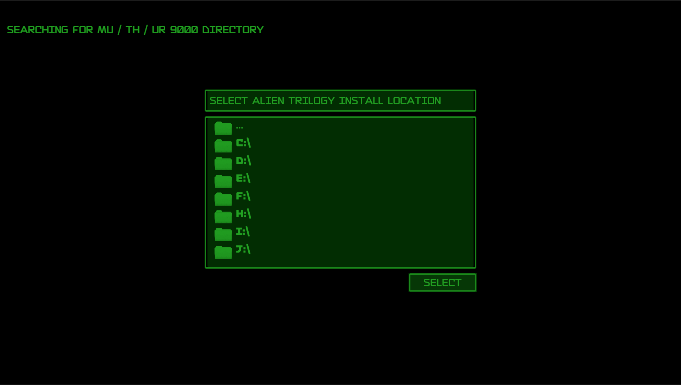
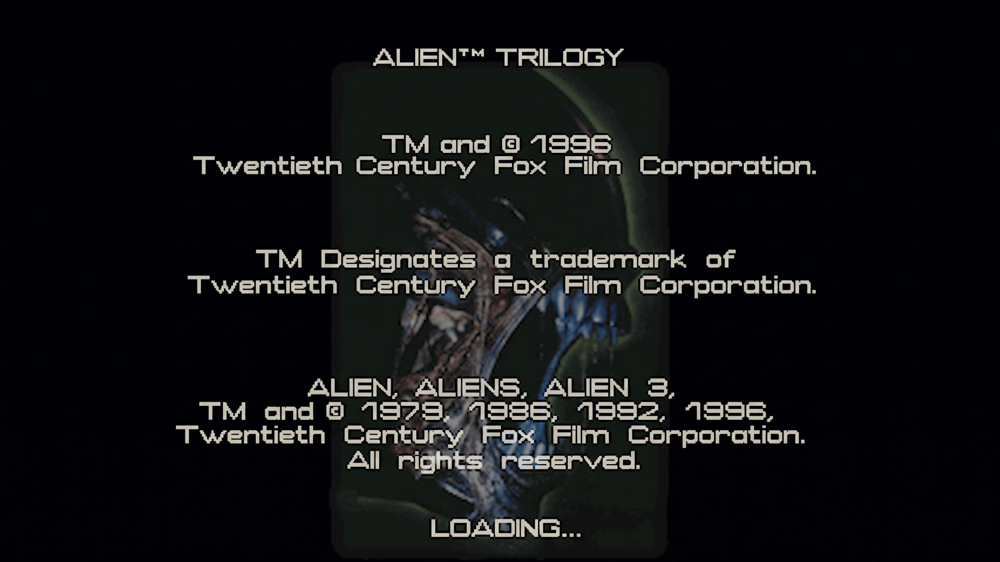
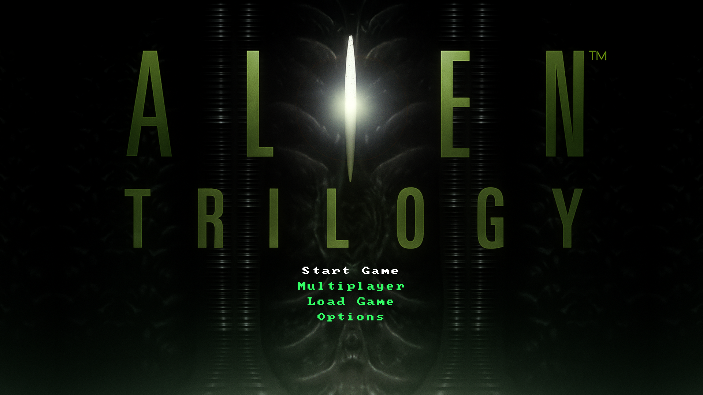
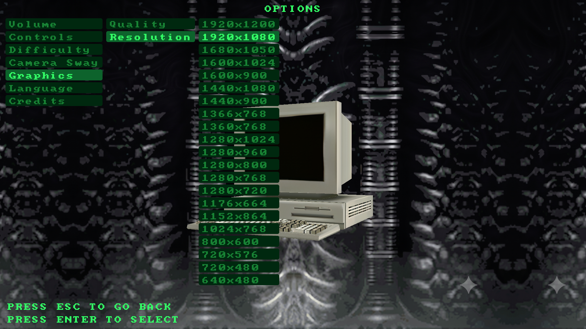
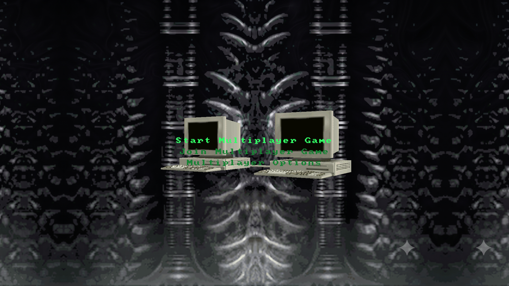
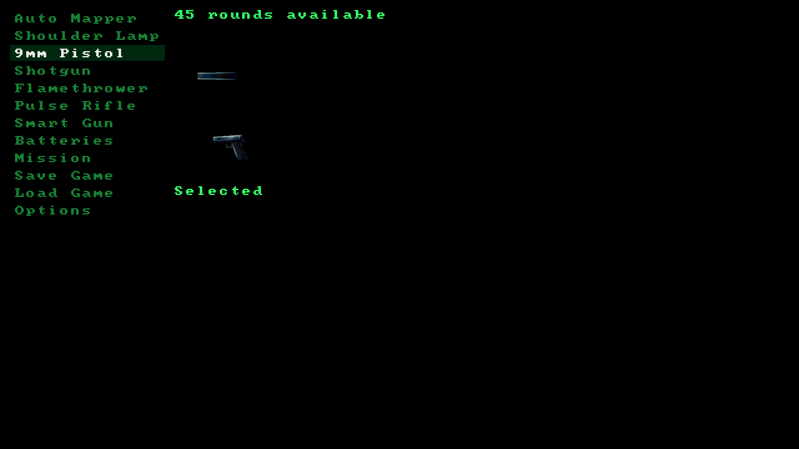
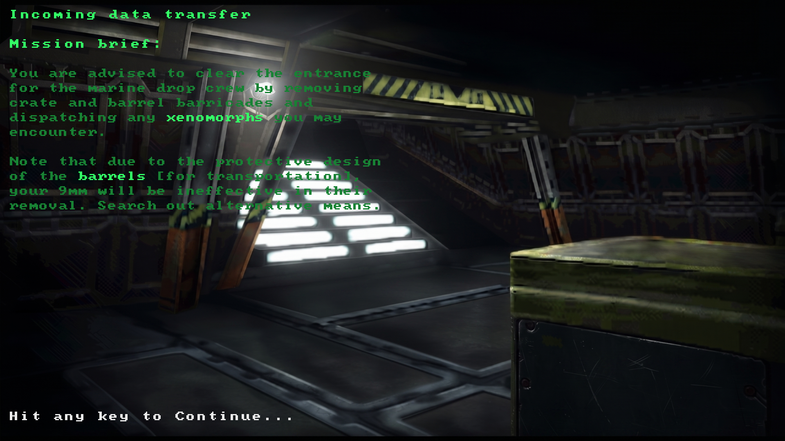
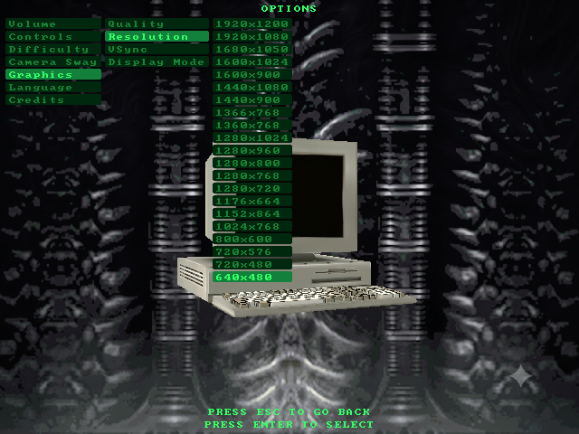
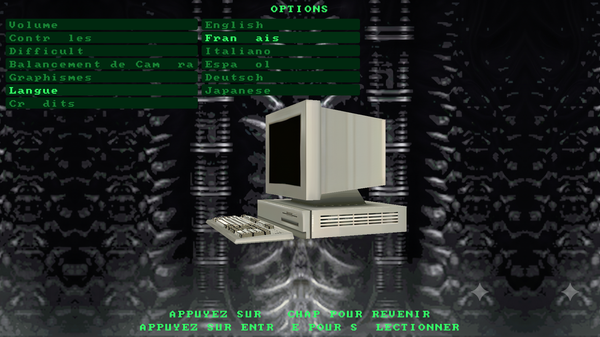

# Alien Trilogy Resurrection

This project aims to create a modding toolkit and possibly more for Alien Trilogy.

- 1 : Install the game from : https://collectionchamber.blogspot.com/2017/05/alien-trilogy.html or from an original media source.
- 2 : Download and install the latest version of the toolkit from [the releases page](https://github.com/Thor110/AlienTrilogyResurrection/releases) then place it in the game directory. ( Alongside "Run.exe" or "TRILOGY.EXE" )
- 3 : Optional : Install any patches using the patch button in the tool, the details of all patches made to original game files are in the "Patch" folder of this repository.

# Notes

This optional step has been removed as it needs revising sometime in the future, so ignoer it for now.

- # : Optional : Use the cleanup script and files provided in "Notes\repack-disc-comparison\CLEANUPSCRIPT" to delete 83.35MBs of unused files from the game. ( documentation and details on these files and more can be found in "Notes\repack-disc-comparison\readme.txt" )

# To Do List

- Source Port
	- Gameplay Mechanics
	- Sounds & Music
	- Multiplayer
- Text Editor
	- UI text viewing .BIN files plaintext.
	- Editing and saving functionality.
- Model Viewer
	- M036 is an unused model and does not have a corresponding texture.
	- M039 is an unused model which is the same as the #41 the egg-husk.
	- M040 is the hibernation pod cover which does not have a texture, I believe this is likely coloured in code with a single colour.
- Graphics Viewer
	- Compressed images can not be replaced yet, until I implement a recompression algorithm that matches the original exactly.
- Level Viewer
	- Not really a level "viewer" per-se, currently it is just a testing tool for parsing level data, it can also export the level geometry as OBJ files.
	- May or may not extend it to level viewer and editor functionality one day.
	- Need to implement an export feature for the location of level objects, enemies, crates, pickups, switches, doors etc
- Patches
	- Multiple UVs across the games levels, lifts and doors need fixing.
	- The UVs for the Queens Egg Sack from the final level need fixing.

# Road Map

The road map for this project.

- [❌ 0 : Source Port](#source-port) ( 25% Complete )
	- Original CD detection and selective asset extraction
	- Automated Redbook CD-DA audio ripping and pre-bundled playlist generation
	- Native image and video override architecture
	- Upgraded cutscene video playback pipeline (BSRGAN upscaled via local NCNN, batch-processed through FFmpeg)
	- Integrated main menu audio, functional layout drafts, options configs, resolution detection  and selection.
	- Graphics quality options smoothed and original rendering styles. (WIP)
	- Resolution scaling.
	- Modular language localization system.
- [❌ 1 : Text Editor](#text-editor) ( 50% Complete )
	- View text from the games missions and user interface.
	- Editing and saving functions not implemented yet.
	- Effectively a cancelled feature, the text is stored in .txt and .bin files as plain text. If you want to edit those, you don't need a toolkit for it.
- [✅ 2 : Model Viewer](#model-viewer) ( 99% Complete )
	- Can extract models from the three known model files.
	- Does not currently extract the associated textures alongside them.
- [✅ 3 : Graphics Viewer](#graphics-viewer) ( 99% Complete )
	- Palette detection implemented.
	- Toggle palette export or transparency for viewing and exporting.
	- View, export and replace textures, replacing compressed images is not supported yet. ( .B16 files, weapons and enemies. )
	- Automatic backup of the original file by default.
- [✅ 4 : Palette Editor](#palette-editor) ( 100% Complete )
	- Palette editor and image preview.
	- View, export, import and edit palettes for all types of images. ( Embedded, External & Compressed )
	- Visual feedback showing unused colours across all sections and frames, except for embedded palettes where each section has its own colour palette.
	- Automatic backup of the original file by default.
- [✅ 5 : Sound Effects Viewer](#sound-effects-viewer) ( 100% Complete )
	- .RAW audio files can be played, replaced and converted to and from .WAV files.
	- Waveform preview for selected sound files.
	- Link to the music directory, only available with the repack.
	- Automatic backup of the original file by default.
- [❌ 6 : Level Viewer](#level-viewer) ( 99% Complete )
	- Map files detected and listed.
	- Basic details parsed and listed.
	- Export level geometry as OBJ files.
	- Export levels with debug and unknown byte flags displayed visually.
	- Export door and lift geometry as OBJ files.
	- Does not currently extract the associated textures alongside them.
	- Provides a list based interface for looking through the parsed objects within each level.
	- Has a preview of the levels map generated using the collision blocks parsed for the level.
- [❌ 7 : Patches](#patches) ( ??% Complete )
	- [Patched an issue on L906LEV where a vertex had incorrect coordinates.](#L906LEV-Multiplayer-Map-7-Fix-1)
	- [Patched an issue on L906LEV where four faces were lacking the double sided transparency flag.](#L906LEV-Multiplayer-Map-7-Fix-2)
	- [Patched an issue on L906LEV where one railing was lacking the double sided transparency flag.](#L906LEV-Multiplayer-Map-7-Fix-3)
	- [Patched an issue on L906LEV where one railing was lacking the double sided transparency flag.](#L906LEV-Multiplayer-Map-7-Fix-4)
	- [Patched an issue on L906LEV where 8 different bridge sections had incorrect textures and UV coordinates.](#L906LEV-Multiplayer-Map-7-Fix-5)
	- [Patched an issue on L906LEV where doors had incorrectly flipped textures.](#L906LEV-Multiplayer-Map-7-Fix-6)
	- [Patched an issue on L905LEV where 2 textures were flipped when they shouldn't have been.](#L905LEV-Multiplayer-Map-6-Fix-1)
	- [Patched an issue on L905LEV where lots of different textures were flipped when they shouldn't have been.](#L905LEV-Multiplayer-Map-6-Fix-2)
	- [Patched an issue on L903LEV where some crates had incorrect textures.](#L903LEV-Multiplayer-Map-4-Fix-1)
	- [Patched an issue on L901LEV where player storage was located within the level boundaries.](#L901LEV-Multiplayer-Map-2-Fix-1)
	- [Patched an issue on L900LEV where four crates had textures which were sideways.](#L900LEV-Multiplayer-Map-1-Fix-1)
	- [Patched an issue on L900LEV where multiple texture flags were incorrectly set.](#L900LEV-Multiplayer-Map-1-Fix-2)
	- [Patched an issue on L900LEV where a vertice in the first lift had the wrong Z coordinate.](#L900LEV-Multiplayer-Map-1-Fix-3)
	- [Patched an issue on L111LEV where four crates had textures which were sideways.](#L111LEV-Fix-1)
	- [Patched an issue on L111LEV where multiple texture flags were incorrectly set.](#L111LEV-Fix-2)
	- [Patched an issue on L111LEV where a vertice in the first lift had the wrong Z coordinate.](#L111LEV-Fix-3)
	- [Patched an issue on L141LEV where some crates had incorrect textures.](#L141LEV-Fix-1)
	- [Patched an issue on L161LEV where one face had an incorrect texture.](#L161LEV-Fix-1)
	- [Patched an issue on L161LEV where one face on a door had an incorrect texture.](#L161LEV-Fix-2)
	- [Patched an issue on L162LEV where one face on the starting door had an incorrect texture.](#L162LEV-Fix-1)
	- [Patched an issue on L371LEV where a secret area was inaccessible.](#L371LEV-Fix-1)
	- [Patched an issue on L371LEV where two faces had incorrect textures.](#L371LEV-Fix-2)
	- [Patched an issue on L371LEV where one of the textures unused tiles showed up at the edges of some faces.](#L371LEV-Fix-3)
- [✅ 8 : Easter Eggs](#easter-eggs) ( ??% Complete )
	- [Grade 33 Steel](#easter-egg-1)
	- [End Times](#easter-egg-2)
	- [Cheats](#easter-egg-3)

And possibly more to come.

Discord : https://discord.gg/Mk2YUuPmdU

## Documentation

Special thanks to Bobblen147 who created this repository : https://github.com/Bobblen147/atril_geom_extract

They also pointed me to the partial file format documentation and the texture decompression source code from Lex Safanov, the links to which are also in their repository on the great preserver archive.org which will save me endless amounts of time manually decoding the filetypes.

Also a big thanks to Lex Safanov for posting their source code for decompression of .B16 files, I used this as reference when reimplementing it for this project.

A thanks to bambamalicious for discovering the fix for the inaccessible secret on L371LEV.

And thanks to Kaiser for information regarding animated textures and some other previously unknown bytes.

## Source Port

Source port is currently a work in progress.

MU/TH/UR Computer System Interface

This is used to locate the disc or game installation, copy the necessary files, rip the music tracks, patch game files and is only shown on the first launch of the game.

  

Legal Screen - Upscaled

  

Probe Logo Video - Upscaled

  

Main Menu - Upscaled Background

  

Options Menu - Upscaled Background

  

Multiplayer Menu - Upscaled Background

  

Pause Menu

  

Briefing Menu - Upscaled Background

  

Resolution Scaling

  

Localization System - Modular Language Packs

  

## Alien Trilogy Viewer

The main program window.

  

## Text Editor

Edit text in the game, intended for localisation efforts.

  

## Model Viewer

Extract models from the games files.

  

A showcase of some of the models from the games files.

  

## Graphics Viewer

View, extract and replace textures from the game.

  

View, extract and replace animation frames in the game. ( Note : Replacing animation frames is not supported yet )

  

Replace textures. ( Example : Barrel texture used for the Crate )

  

## Palette Editor

Preview, edit, save, import and export palettes while previewing the image it belongs to.

  

This image shows a compressed file palette that has been replaced.

  

This image shows an embedded palette that has been replaced.

  

## Sound Effects Viewer

Listen to, extract, replace or restore audio files from backups.

  

## Level Viewer

View level data and export level models as OBJ files.

  

Preview of L111LEV exported as an OBJ file.

  

A view of L112LEV from within Blender.

  

A preview of the door D000 from L111LEV.

  

A preview of the lift L000 from L232LEV.

  

## Patches

I am also looking at making patches for any issues I find in the original game.
- [Patched an issue on L906LEV where a vertex had incorrect coordinates.](#L906LEV-Multiplayer-Map-7-Fix-1)
- [Patched an issue on L906LEV where four faces were lacking the double sided transparency flag.](#L906LEV-Multiplayer-Map-7-Fix-2)
- [Patched an issue on L906LEV where one railing was lacking the double sided transparency flag.](#L906LEV-Multiplayer-Map-7-Fix-3)
- [Patched an issue on L906LEV where one railing was lacking the double sided transparency flag.](#L906LEV-Multiplayer-Map-7-Fix-4)
- [Patched an issue on L906LEV where 8 different bridge sections had incorrect textures and UV coordinates.](#L906LEV-Multiplayer-Map-7-Fix-5)
- [Patched an issue on L906LEV where doors had incorrectly flipped textures.](#L906LEV-Multiplayer-Map-7-Fix-6)
- [Patched an issue on L905LEV where 2 textures were flipped when they shouldn't have been.](#L905LEV-Multiplayer-Map-6-Fix-1)
- [Patched an issue on L905LEV where lots of different textures were flipped when they shouldn't have been.](#L905LEV-Multiplayer-Map-6-Fix-2)
- [Patched an issue on L903LEV where some crates had incorrect textures.](#L903LEV-Multiplayer-Map-4-Fix-1)
- [Patched an issue on L901LEV where player storage was located within the level boundaries.](#L901LEV-Multiplayer-Map-2-Fix-1)
- [Patched an issue on L900LEV where four crates had textures which were sideways.](#L900LEV-Multiplayer-Map-1-Fix-1)
- [Patched an issue on L900LEV where multiple texture flags were incorrectly set.](#L900LEV-Multiplayer-Map-1-Fix-2)
- [Patched an issue on L111LEV where four crates had textures which were sideways.](#L111LEV-Fix-1)
- [Patched an issue on L111LEV where multiple texture flags were incorrectly set.](#L111LEV-Fix-2)
- [Patched an issue on L141LEV where some crates had incorrect textures.](#L141LEV-Fix-1)
- [Patched an issue on L161LEV where one face had an incorrect texture.](#L161LEV-Fix-1)
- [Patched an issue on L161LEV where one face on a door had an incorrect texture.](#L161LEV-Fix-2)
- [Patched an issue on L162LEV where one face on the starting door had an incorrect texture.](#L162LEV-Fix-1)
- [Patched an issue on L371LEV where a secret area was inaccessible.](#L371LEV-Fix-1)
- [Patched an issue on L371LEV where two faces had incorrect textures.](#L371LEV-Fix-2)
- [Patched an issue on L371LEV where one of the textures unused tiles showed up at the edges of some faces.](#L371LEV-Fix-3)

## L906LEV Multiplayer Map 7 Fix 1

Here is how the level was originally.

  

This would cause this to appear when close enough to the missing triangle.

  

Here it is with the fix I applied to the level.

  

## L906LEV Multiplayer Map 7 Fix 2

Here is how the level was originally.

  

Here it is with the fix I applied to the level.

  

## L906LEV Multiplayer Map 7 Fix 3

Here is how the level was originally.

  

Here it is with the fix I applied to the level.

  

## L906LEV Multiplayer Map 7 Fix 4

Here is how the level was originally.

  

Here it is with the fix I applied to the level.

  

## L906LEV Multiplayer Map 7 Fix 5

Here is how the level was originally.

  

Here it is with the fix I applied to the level.

  

Currently this is only fixed when exporting the model and partially fixed in the original game files.

## L906LEV Multiplayer Map 7 Fix 6

Here is how the level was originally.

  

Here it is with the fix I applied to the level.

  

## L905LEV Multiplayer Map 6 Fix 1

Here is how the level was originally.

  

Here it is with the fix I applied to the level.

  

## L905LEV Multiplayer Map 6 Fix 2

Here is how the level was originally.

  

Here it is with the fix I applied to the level.

  

## L903LEV Multiplayer Map 4 Fix 1

[These fixes are the same as on L141LEV](#L141LEV-Fix-1)
	
Currently this is only fixed when exporting the level model.

## L901LEV Multiplayer Map 2 Fix 1

This shows where four enemy types are spawned within the level, in other levels these are clustered together off of the map.

The four highlighted objects show where player movement was previously blocked.

I believe these enemy types are placeholders for the players. Image taken within an abandoned unity toolkit based off of my code.

  

Here it is with the fix I applied to the level.

  

## L900LEV Multiplayer Map 1 Fix 1

[These fixes are the same as on L111LEV](#L111LEV-Fix-1)

Currently this is only fixed when exporting the level model.

## L900LEV Multiplayer Map 1 Fix 2

[These fixes are the same as on L111LEV](#L111LEV-Fix-2)

## L900LEV Multiplayer Map 1 Fix 3

Patch listed at Patch/new-fix.txt

Not implemented in the toolkit yet

## L111LEV Fix 1

These fixes are the same as on L900LEV

Here is how the level was originally.

  

Here it is with the fix I applied to the level.

  

Currently this is only fixed when exporting the level model.

## L111LEV Fix 2

These fixes are the same as on L900LEV

Here is how the level was originally.

  

Here it is with the fix I applied to the level.

  

## L111LEV Fix 3

Patch listed at Patch/new-fix.txt

Not implemented in the toolkit yet

## L141LEV Fix 1

These fixes are the same as on L903LEV

Here is how the level was originally.

  

Here it is with the fix I applied to the level.

  

Here is how the level was originally.

  

Here it is with the fixes I applied to the level.

  

Currently this is only fixed when exporting the level model.

There are a few other similar issues with textures that I have fixed but which I have not screenshotted here, the exact indices of the faces which have been adjusted can be found in the code : (https://github.com/Thor110/AlienTrilogyResurrection/blob/main/ALTViewer/ModelRenderer.cs#L267)

## L161LEV Fix 1

Here is how the level was originally.

  

Here it is with the fix I applied to the level.

  

Currently this is only fixed when exporting the level model.

## L161LEV Fix 2

Here is how the level was originally.

  

Here it is with the fix I applied to the level.

  

## L162LEV Fix 1

Here is how the level was originally.

  

Here it is with the fix I applied to the level.

  

## L371LEV Fix 1

bambamalicious tracked down the fix for this issue, which turned out to just be a single incorrect byte.

## L371LEV Fix 2

One face towards the end of the level was textured with an unused tile instead of the correct texture, this is now fixed.

## L371LEV Fix 3

The empty textures on the fourth texture sheet were previously purple, which showed up on the edges of some faces in the level, the background is now a similar dark shade to the rest of the textures.

## Easter Eggs

Here is a collection of the easter eggs I have found within the games files.

## Easter Egg 1

Object type 33 is the Steel Coil, which may be a nod to Grade 33 steel, the first widely adopted U.S. structural steel grade (ASTM A15, 1911).

  

The object type is stored in a byte (0-255) so if the assignment is random and every one of the 256 potential values is equally likely, the chance the Steel Coil specifically lands on 33 is 1 ÷ 256 = 0.00390625 = 0.390625% (~0.39%).

## Easter Egg 2

These two level textures contain the message "SATAN LIVES HERE"

  

351GFX_TP00 and 371GFX_TP00 are the names of the textures when extracted by this toolkit.

## Easter Egg 3

This texture contains a reference to the cheat "RIPLEYDOESITWITHBIGGUNS" as well as two messages.

  

909GFX_TP00 is the name of the texture when extracted by this toolkit.